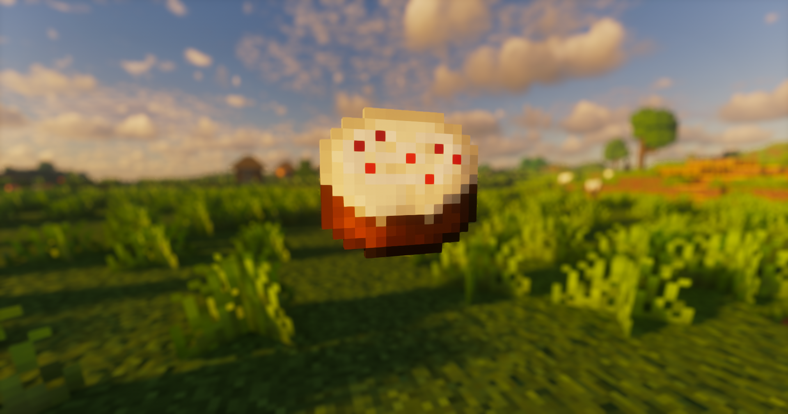

# PBR Tweaks
 Unofficial PBR resource pack for [Vanilla Tweaks](https://vanillatweaks.net/)

 
 

# Instructions
Depending on the resource pack you've chosen in Vanilla Tweaks, locate the appropriate folder within the downloaded directory. Then, relocate the "textures" folder from that directory into the resource pack.

 
 

# Screenshots
Screenshots with Kappa shader and PNAPBR

