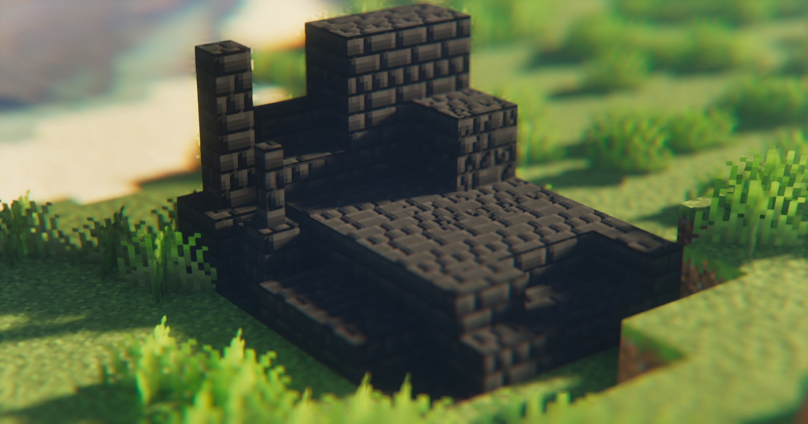

# PBR Tweaks
 Unofficial PBR resource pack for [Vanilla Tweaks](https://vanillatweaks.net/)

</br>
</br>

# Instructions
This resource pack exclusively supports LabPBR.  
The following shader packs are not supported:
- SEUS
- Continuum 1.3 ~ 2.0.4

</br>

Additionally, it is not compatible with the following Vanilla Tweaks resource packs, as shader packs are mandatory:
- Warm Glow
- Twinkling Stars
- Brighter Nether
- Mob Spawn Indicator
- Fullbright
- No Fog
- No Vignette
- Hardcore Darkness

</br>

Furthermore, the following packs are not created as separate PBR resource packs:
- Particle, HUD, Banner Pattern / Cannot apply PBR textures
- If only the colors are changed in the original textures / Using a different Vanilla - PBR resource pack is sufficient


</br>
</br>

# Labpbr Support
|Normals|Height Map|Rough|AO|Porosity|Emission|SSS|F0
|------|---|:---:|:---:|:---:|:---:|:---:|:---:|
|✔️|✔️|✔️|✔️|❌|❌|❌|✔️|

</br>
</br>

# Screenshots
Screenshots with [PNAPBR](https://www.curseforge.com/minecraft/texture-packs/please-not-another-vanilla-pbr)




[More Screenshots](images/README.md)

</br>
</br>

# Terms of Use
PBR Tweaks is subject to the same terms as Vanilla Tweaks, which can be found [here](https://vanillatweaks.net/terms/).  
Additionally, you must include the following text in credits.txt:
```
Credits:
Vanilla Tweaks: https://vanillatweaks.net/
PBR Tweaks: https://github.com/DominoKorean/PBR-Tweaks
```

</br>
</br>

# Credits:
Vanilla Tweaks: https://vanillatweaks.net/